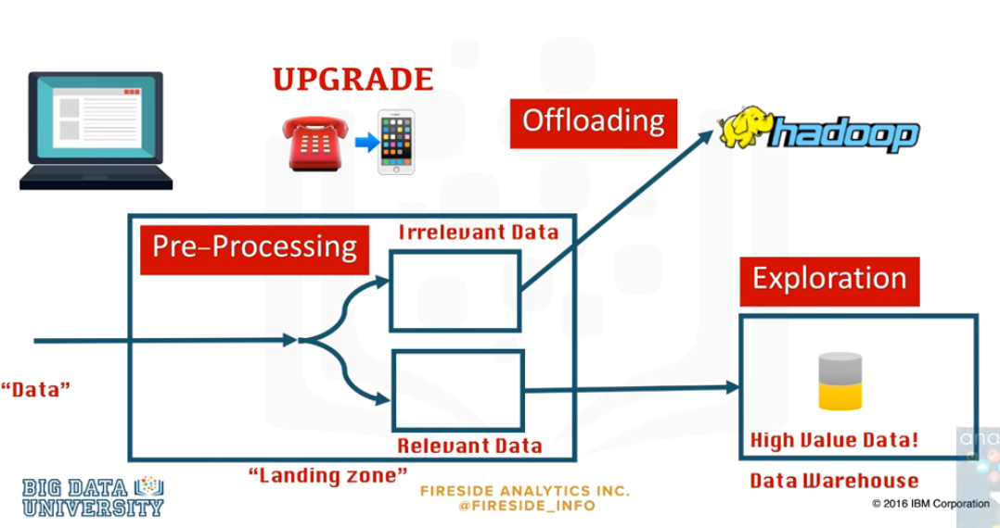

### Hadoop introduction
Hadoop is an open source framework used to store and process huge amounts of data. It's implemented in several distinct , specialized modules:
- Storage. Using HDFS
- Resource management and scheduling for computational tasks.
- Distributed processing programming model based on mapReduce
- Common utilities and software lirbaries needed for the entire platform
#### hadoop strategy
- Chosing recommended distributions 
- Maturing the environment with hybrid architectures
- Adopting a data lake strategy based on Hadoop
#### Data warehouse dataflow using hadoop adn data lakes

