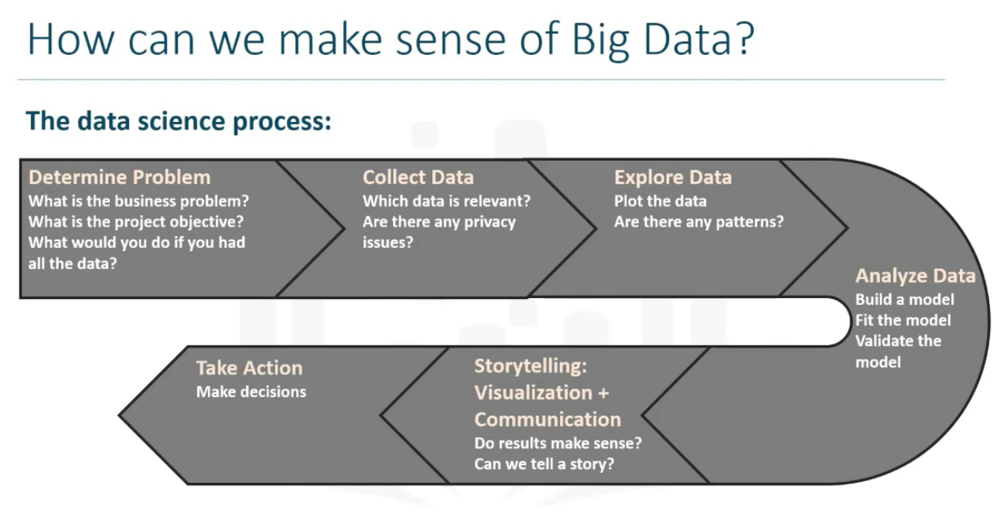

### Introduction to big data
- It's relative. What's big data today probably is not in 5 years
- It's whenever the resources you have are not enough to process the data you have
- Can be considered as digital trace that we leave behind in our daily use
#### The 5 Vs
- Velocity. Data is being generated extremely fast, a process that never stops; and the speed at which data is transformed into insight.
- Volume. The amount of data generated is vast compared to traditional data sources.
- Variety. Data comes from different sources: machines, people, processes both from inside and outside the organization.
- Veracity. Quality and origin of data.
- Value. Ability and need to turn data into value
#### The data science process:
- Determine the problem. 
- Collect data.
- Explore data.
- Analyze.
- Visualization.

