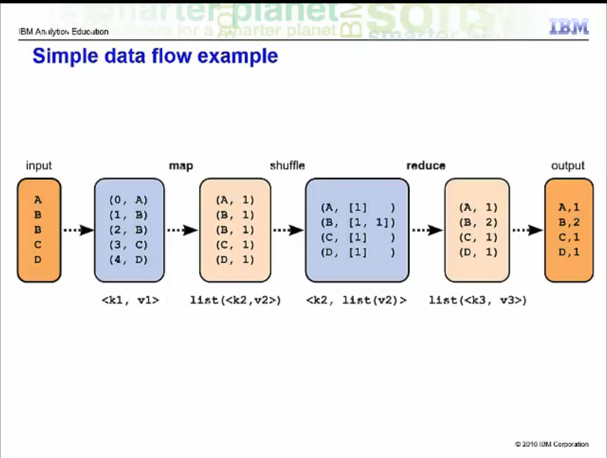

### Most important config files
- core-site.xml.- Settings that are common to MapReduce and HDFS
- hdfs-site.xml.- Settings for the daemon such as name node, data nodes...
- mapred-site.xml.- Settings for Mapreduce daemon such as jobtracker and tasktrackers

### Components
#### MapReduce

#### Pig 
- Translate high-level languages into MapReduce jobs
- Not suitable for low-latency queries or random read/writes
- Dataflow language
- Relationally complete
- Schema optional
- How to run it:
    - pig script.pig
    - pig (command line tool)
    - Embedded in Java
#### Hive
- Translate high-level languages into MapReduce jobs
- Not suitable for low-latency queries or random read/writes
- Declerative language (like SQL)
- Relationally complete
- Schema non-optional
- How to run it:
    - hive -f script
    - hive -e 'SELECT * FROM t'
    - hive (command line tool)
