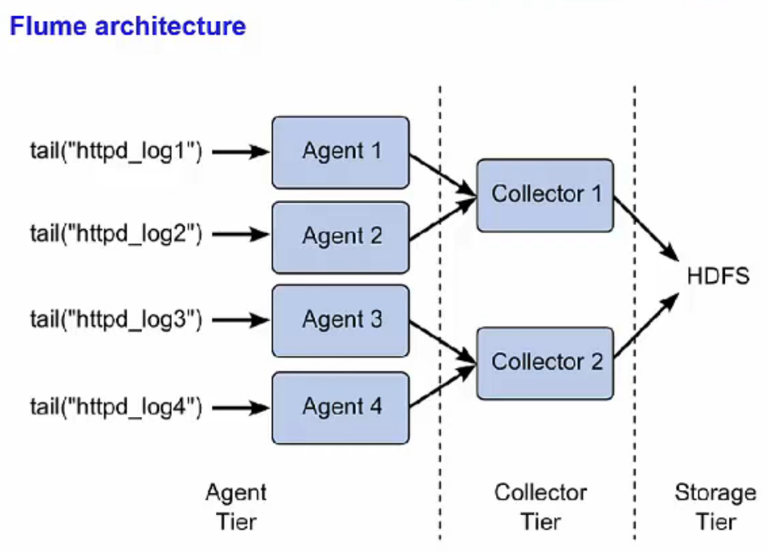

### Feeding Haddop with data
#### Flume
- Data queue to move data into Hadoop
- Commonly used for gathering lof files from every machine in a cluster

#### Sqoop
- Transfer data between Haddop and relational DBs using JDBC
- Uses MR to import/export data
#### Oozie
- Event manager for Hadoop
- It works as Direct Acyclic Graph (DAG) means next step won't run till the previous wa succeed
- Jobs are written in hPDL, an XML Process Definition Language
